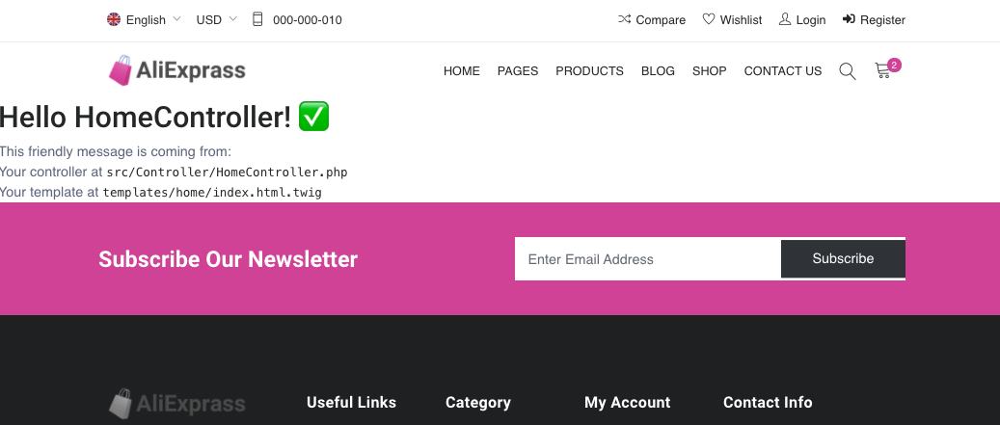

#  :shopping: AliExprass - Ecommerce website

## Create an E-shop 

## Illustration


## Language/tools
- HTML5 / CSS3 
- PHP / SYMFONY
- DOCTRINE

## Goals 
- Discover PHP framework : Symfony 5
- Work on e-commerce website
- Discover SQLite database
- Discover the ORM Doctrine
- UX / UI

## How to use 


### Launch the development server & meeting on http://localhost:8080/
``` php
symfony server:start
```

## Status
Project not completed

## Context
Project developed as a junior web developer

